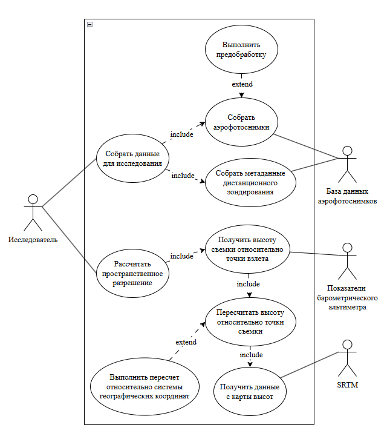
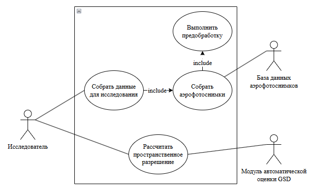

# Лабораторная работа №1

**Тема**: Формулирование требований к программной системе

**Цель работы**: Научиться анализировать поставленную задачу, формулировать функциональные и нефункциональные требования к проектируемой системе.

## Перечень заинтересованных лиц (стейкхолдеров)

- Ланин Вячеслав Владимирович, академический руководитель - является заказчиком проекта со стороны НИУ ВШЭ.
- Викентьева Ольга Леонидовна, научный руководитель - является руководителем проекта со стороны НИУ ВШЭ. Полномочия руководителя проекта (научного руководителя) заключаются в утверждении темы, целей, плана-графика и всех ключевых результатов дипломной работы.
- Научно-исследовательские группы, работающие с геоданными - это ключевые пользователи результата проекта.

## Перечень функциональных требований

1. Автоматическое определение пространственного разрешения (GSD) для одиночных аэрофотоснимков.
2. Поддержка обработки изображений в форматах: GeoTIFF, JPEG, PNG.
3. Вывод результата оценки GSD в метрах на пиксель.
4. Пакетная обработка групп изображений.

## Диаграмма вариантов использования

**AS-IS**

**TO BE**

## Перечень сделанных предположений

Предполагается доступ к CPU с производительностью не ниже Intel Core i5 10-го поколения для выполнения требования по времени обработки 5 секунд на изображение. В идеале наличие доступа к GPU вычислителю, но универсальным вариантом является вычисление на CPU.

Предполагаются размеры изображений, которые использовались при обучении. В случае превышения размера необходимо делать кроп.

Снимки предполагаются без критических искажений и артефактов, что необходимо для достижения целевой точности 15% MAPE. Также стоит придерживаться гипотезы о том, что нет внешнего ковариационного сдвига (смещение распределения входных данных от обучающей выборки).

Предполагается сохранение обратной совместимости основных используемых библиотек (PyTorch, OpenCV, NumPy) в течение жизненного цикла проекта (отсюда нужно учесть совместимость с версией питона).

Предполагается пакетная обработка данных (зависит от размера батча при обучении). Не предусматривается работа в режиме реального времени.

Предполагается, что пользователи обладают базовыми навыками работы с Python-окружением и API запросами для использования модуля.

## Перечень нефункциональных требований

1. **Точность оценки GSD: погрешность менее 15% на тестовой выборке** - тут такая формулировка из-за метрики, которая используется в самой работе - MAPE. Эта метрика показывает процентное отклонение от верного результата, в контексте масштабов лучше использовать именно её, так как абсолютные величины не отражают порядки ошибки. (функциональная пригодность - корректность)
2. **Время обработки одного изображения: не более 5 секунд на CPU** - вообще лучше делать инференс на GPU и предоставлять требование по FLOPs, однако вариант с временем инференса на CPU тоже часто применим и является универсальным. (производительность)
3. **Поддержка Python 3.8+** - связано с зависимостью от фреймворка PyTorch, с помощью которого происходит инференс модели. (совместимость)
4. **Предоставление программного интерфейса (API) для интеграции с внешними системами** - работа с модулем в принципе будет осуществляться через API. (переносимость)
