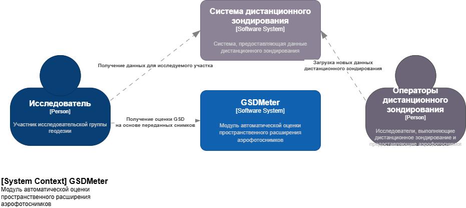

# Лабораторная работа №2

Тема: Использование нотации C4 model для проектирования архитектуры программной системы
Цель работы: Получить опыт использования графической нотации для фиксации архитектурных решений.

## Диаграмма системного контекста

**Диаграмма системного контекста**

## Диаграмма контейнеров

В качестве базвого архитектурного типа была выбрана архитектура на сервисах, так как по требованиям все взаимодействие должно происходить с помощью API. Также нужна возможность независимого масштабирования (изменение препроцессинга и моделей для обучения). За счет этого повышается отказоустойчивость.

**Диаграмма контейнеров**

## Диаграмма компонентов

**Диаграмма компонента ImagePreprocessor**

**Диаграмма компонента ML Inference Runner**
