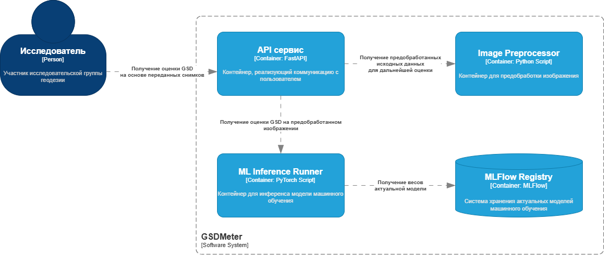
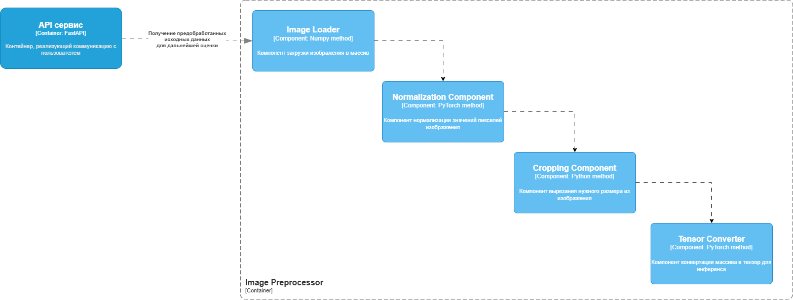
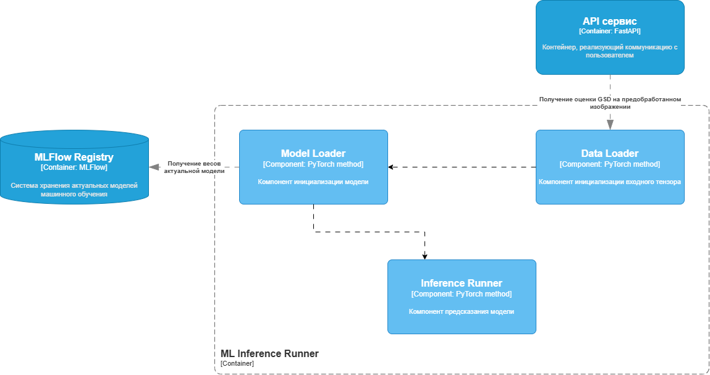
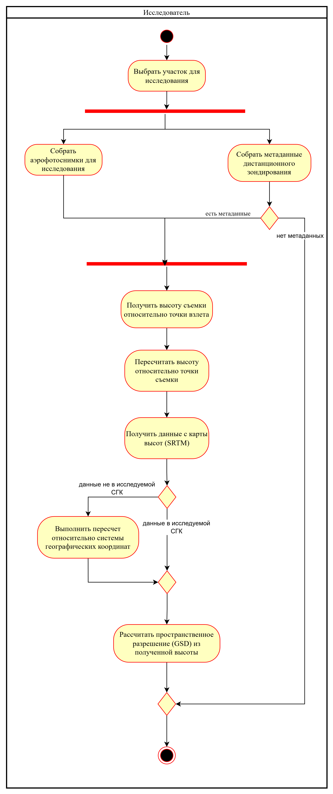
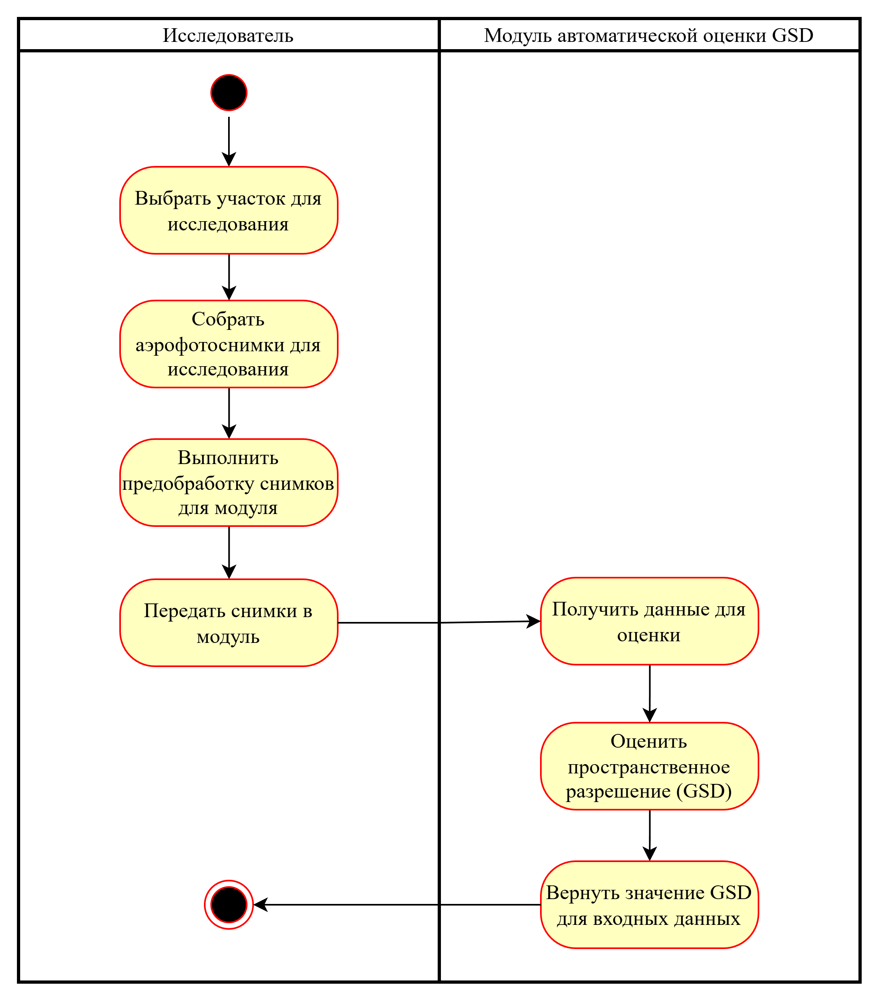
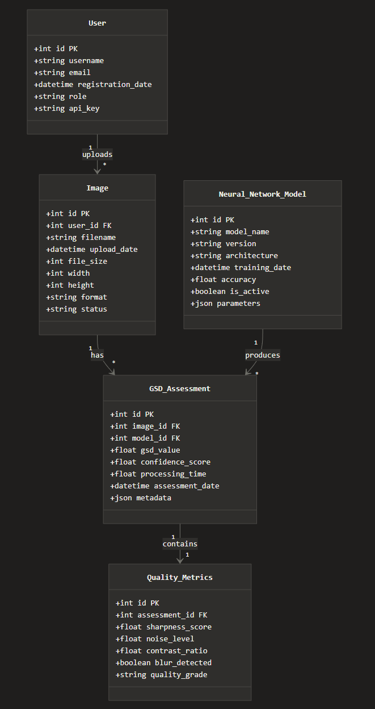

# Лабораторная работа №3

Тема: Использование принципов проектирования на уровне методов и классов
Цель работы: Получить опыт проектирования и реализации модулей с использованием принципов KISS, YAGNI, DRY, SOLID и др.

## Диаграмма контейнеров

В качестве базвого архитектурного типа была выбрана архитектура на сервисах, так как по требованиям все взаимодействие должно происходить с помощью API. Также нужна возможность независимого масштабирования (изменение препроцессинга и моделей для обучения). За счет этого повышается отказоустойчивость.

**Диаграмма контейнеров**

## Диаграмма компонентов

**Диаграмма компонента ImagePreprocessor**

**Диаграмма компонента ML Inference Runner**

## Диаграмма активности

**Диаграмма активности AS IS**

**Диаграмма активности TO BE**

## Модель БД

Для проекта не предусмотрена БД, однако была представлена схема, которая содержит возможные сущности для такой системы. В схеме представлено 5 сущностей:

- User
- Image
- Model
- Quality Metrics
- GSD Assessment

**Диаграмма классов для БД**

## Применение основных принципов разработки

Был реализован базовый клиентский код для API, который можно посмотреть в файле `clietn_api.py`.

*KISS (Keep It Simple, Stupid)*

- Клиент предоставляет простой и понятный публичный интерфейс для основных сценариев: проверка доступности сервиса, отправка изображения на оценку, получение результатов.

- Сложная внутренняя логика (HTTP-запросы, валидация, парсинг ответов) скрыта за высокоуровневыми методами.

- Используются стандартные и широко применяемые инструменты и подходы, без избыточных абстракций.

- Форматы входных и выходных данных интуитивно соответствуют предметной области (оценка GSD аэрофотоснимков).

*YAGNI (You Aren’t Gonna Need It)*

- Реализованы только те операции, которые необходимы для текущего сценария оценки GSD (загрузка изображений, получение оценок, базовая работа с результатами).

- Нет преждевременной поддержки дополнительных форматов, нестандартных протоколов или сложных сценариев расширения.

- Отсутствует логика, не связанная напрямую с задачей оценки пространственного разрешения (например, аналитика, агрегации, сложные кэш-механизмы).

- API клиента ориентирован на реальные потребности пользователя, а не на гипотетические будущие требования.

*DRY (Don’t Repeat Yourself)*

- Повторяющаяся логика работы с HTTP-запросами вынесена в единый низкоуровневый компонент.

- Проверка корректности входных данных централизована и используется повторно во всех сценариях загрузки изображений.

- Преобразование ответов API в доменные структуры данных выполняется в одном месте и переиспользуется.

- Общие структуры данных (результат оценки, информация об изображении, модели) описаны единообразно и не дублируются.

*SOLID*

*S — Single Responsibility Principle*

- Каждый компонент отвечает за одну четко определённую задачу: сетевое взаимодействие, валидацию, парсинг данных, бизнес-логику клиента.

- Доменные структуры данных используются только для хранения состояния и не содержат логики.

*O — Open/Closed Principle*

- Архитектура допускает расширение (например, добавление новых endpoint’ов или типов ответов) без изменения существующей логики.

- Новые сценарии работы с API могут быть добавлены за счёт новых методов или компонентов.

*L — Liskov Substitution Principle*

- Исключения и возвращаемые типы используются согласованно, что позволяет обрабатывать ошибки единообразно.

- Компоненты могут быть заменены альтернативными реализациями при сохранении контракта (например, другой HTTP-клиент).

*I — Interface Segregation Principle*

- Пользователь клиента взаимодействует только с высокоуровневым интерфейсом, не завися от деталей HTTP, валидации или парсинга.

- Нет «толстых» интерфейсов, заставляющих использовать лишние методы.

*D — Dependency Inversion Principle*

- Высокоуровневый клиент не зависит от конкретных деталей реализации сетевого взаимодействия.

- Внутренние зависимости инкапсулированы и могут быть заменены без изменения внешнего API клиента.

## Дополнительные принципы разработки

*BDUF (Big Design Up Front)*
В проекте по оценке GSD аэрофотоснимков BDUF может применяться на уровне определения общей архитектуры системы до начала активной реализации: выделение сервисов загрузки и предобработки изображений, инференса модели, хранения моделей и результатов, а также клиентского API. Предварительное проектирование контрактов между компонентами, форматов данных и ключевых сценариев использования позволяет снизить риск архитектурных ошибок, особенно с учётом ML-составляющей и потенциального масштабирования системы.

*SoC (Separation of Concerns)*
Для данного проекта принцип разделения ответственности выражается в чётком разделении доменных областей: работа с изображениями, валидация входных данных, инференс нейросетевой модели, агрегация и представление результатов оценки GSD. Такое разделение упрощает сопровождение системы, позволяет независимо развивать отдельные части (например, заменить модель или этап предобработки) и снижает связанность между компонентами.

*MVP (Minimum Viable Product)*
Применение MVP в проекте заключается в реализации минимального набора функциональности, необходимого для получения оценки GSD: загрузка изображения, запуск модели и возврат численного результата с базовыми метриками качества. Это позволяет быстро проверить востребованность подхода, получить обратную связь от пользователей или научных руководителей и избежать преждевременной реализации второстепенных функций.

*PoC (Proof of Concept)*
PoC для данного проекта фокусируется на доказательстве самой возможности корректной оценки пространственного разрешения аэрофотоснимков с использованием выбранной архитектуры нейронной сети. На этом этапе достаточно ограниченного датасета, упрощённого пайплайна и экспериментальной реализации, целью которой является подтверждение работоспособности идеи, а не создание полнофункциональной системы.