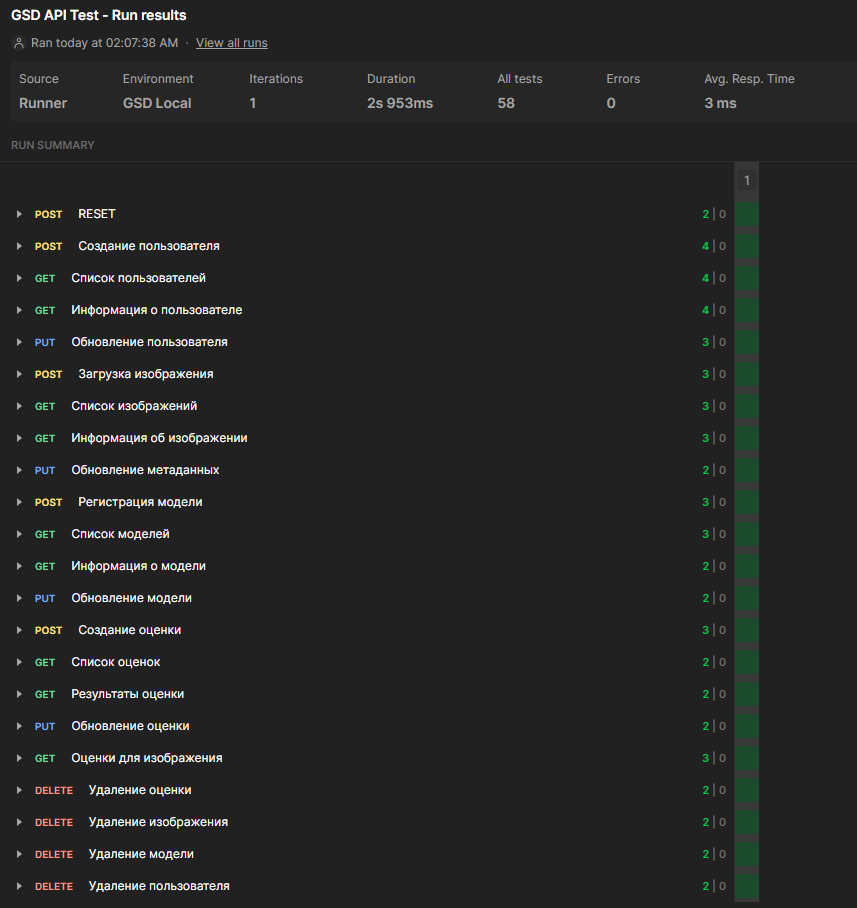
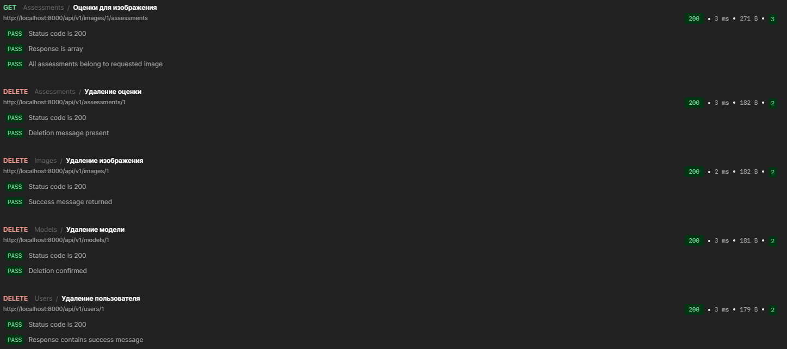

# Лабораторная работа №4

Тема: Проектирование REST API
Цель работы: Получить опыт проектирования программного интерфейса.

## Принятые проектные решения API

### 1. Общая архитектура

- RESTful подход: API спроектирован в соответствии с принципами REST
- Версионирование API: Используется префикс /api/v1/ для обеспечения обратной совместимости
- Контейнеризация: Сервис реализован в контейнере FastAPI для высокой производительности

### 2. Структура данных

- Согласованность с БД: Все модели данных соответствуют структуре предоставленной базы данных
- Валидация данных: Использование Pydantic моделей для строгой типизации и валидации
- JSON как основной формат: Все запросы и ответы используют JSON формат

### 3. Маршрутизация

- Планирование ресурсов: Разделение на 4 основные сущности: Users, Images, Models, Assessments
- Иерархические связи: Использование вложенных маршрутов (например, /api/v1/images/{id}/assessments)
- CRUD операции: Полный набор операций Create, Read, Update, Delete для каждой сущности

### 4. Аутентификация и безопасность

- API Key authentication: Использование заголовка X-API-Key для аутентификации пользователей
- Ролевая модель: Разграничение прав доступа на основе поля role пользователя
- Защита данных: Хэширование чувствительной информации при необходимости

### 5. Обработка ошибок

Стандартизированные HTTP коды:

- 200: Успешный запрос
- 201: Создан новый ресурс
- 400: Неверный запрос
- 404: Ресурс не найден
- 422: Ошибка валидации

Детализация ошибок: Возврат структурированных сообщений об ошибках

### 6. Пагинация и фильтрация

- Пагинация по умолчанию: GET endpoints поддерживают параметры skip и limit
- Фильтрация: Возможность фильтрации по основным полям сущностей
- Сортировка: Параметр sort_by для упорядочивания результатов

### 7. Производительность

- Асинхронная обработка: Использование async/await для неблокирующих операций
- Кэширование: Возможность добавления кэширования частых запросов
- Логирование: Детальное логирование всех операций для отладки

### 8. Документация

- Автогенерация документации: Использование встроенных возможностей FastAPI (Swagger UI)
- Примеры запросов: Предоставление примеров для всех endpoints
- Описание схем: Детальное описание моделей запросов и ответов

## Схема БД

При проектирвании API учитывалась данная схема БД, спроектироаная в ЛР 3.

## Описание API (кратко)

### Users

GET /api/v1/users - список пользователей
GET /api/v1/users/{id} - информация о пользователе
POST /api/v1/users - создание пользователя
PUT /api/v1/users/{id} - обновление пользователя
DELETE /api/v1/users/{id} - удаление пользователя

### Images

GET /api/v1/images - список изображений
GET /api/v1/images/{id} - информация об изображении
POST /api/v1/images - загрузка изображения
PUT /api/v1/images/{id} - обновление метаданных
DELETE /api/v1/images/{id} - удаление изображения

### Neural Network Models

GET /api/v1/models - список моделей
GET /api/v1/models/{id} - информация о модели
POST /api/v1/models - регистрация модели
PUT /api/v1/models/{id} - обновление модели
DELETE /api/v1/models/{id} - удаление модели

### GSD Assessments

GET /api/v1/assessments - список оценок
GET /api/v1/assessments/{id} - результаты оценки
POST /api/v1/assessments - создание новой оценки
PUT /api/v1/assessments/{id} - обновление оценки
DELETE /api/v1/assessments/{id} - удаление оценки
GET /api/v1/images/{id}/assessments - оценки для конкретного изображения

## Документация API

Подробная документация представлена в файле `api_full_docs.md`.

## Реализация API

Спроектирование API было реализовано с помощью FastAPI. Полный код представлен в файле `api.py`.

## Тестирование API

Для тестирования реализованного API использовались автотесты в Postman. Результат прогона и порядок тестов показаны на рисунке.

