# Лабораторная работа №6

**Тема**: Использование шаблонов проектирования

**Цель работы**: Получить опыт применения шаблонов проектирования при написании кода программной системы.

## Шаблоны проектирования GoF

### Порождающие шаблоны

#### Singleton (Одиночка)

Гарантирует, что у класса будет только один-единственный экземпляр, и предоставляет глобальную точку доступа к этому экземпляру. Это полезно для объектов, которые должны существовать в системе в единственном числе, например, для сервисов управления конфигурацией, пулов соединений или, как в нашем случае, для in-memory хранилища данных.

В проекте списки `users_db`, `images_db`, `models_db` и т.д., по сути, являются единым in-memory хранилищем. Они используются по всему приложению как глобальные переменные. Шаблон Singleton позволяет инкапсулировать все эти списки в один класс `DatabaseService`.

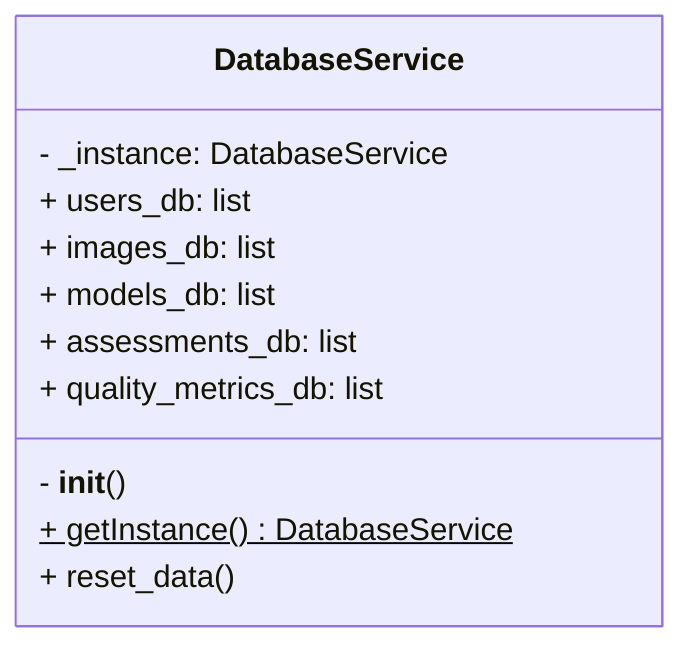

```python
# api.py

class DatabaseService:
    """
    Класс-одиночка для управления in-memory базой данных.
    Хранит все списки данных и предоставляет единую точку доступа.
    """
    _instance = None

    @staticmethod
    def get_instance():
        """Статический метод для получения единственного экземпляра."""
        if DatabaseService._instance is None:
            DatabaseService()
        return DatabaseService._instance

    def __init__(self):
        """
        Конструктор, который вызывается только один раз.
        Приватность эмулируется через проверку _instance.
        """
        if DatabaseService._instance is not None:
            raise Exception("Этот класс - Одиночка! Используйте get_instance().")
        else:
            self.users_db = []
            self.images_db = []
            self.models_db = []
            self.assessments_db = []
            self.quality_metrics_db = []
            DatabaseService._instance = self

    def reset_data(self):
        """Централизованный метод для сброса всех данных."""
        self.users_db.clear()
        self.images_db.clear()
        self.models_db.clear()
        self.assessments_db.clear()
        self.quality_metrics_db.clear()

# В начале приложения создаем единственный экземпляр сервиса
db_service = DatabaseService.get_instance()
```

#### Factory Method (Фабричный метод)

Определяет интерфейс для создания объектов, но позволяет подклассам решать, экземпляры какого класса создавать. В более широком смысле, он инкапсулирует логику создания объекта, скрывая ее от клиента. Клиент вызывает фабричный метод, передавая параметры, и не заботится о том, как именно будет создан объект.

В API процесс создания нового пользователя (объекта `User`) разбросан внутри эндпоинта `create_user`. Мы применяем Factory Method для инкапсуляции этой логики. Создается класс `UserFactory` со статическим методом `create_user`.

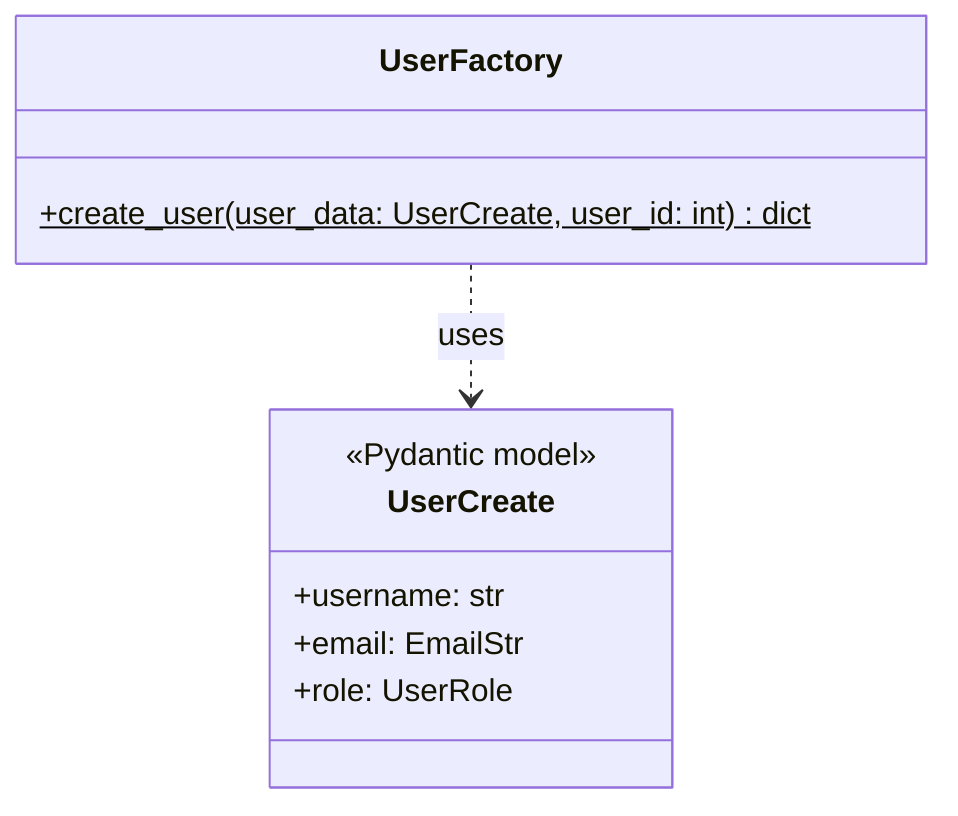

```python
# api.py

class UserFactory:
    """
    Фабрика для создания объектов пользователей.
    Инкапсулирует логику конструирования пользователя.
    """
    @staticmethod
    def create_user(user_data: UserCreate, user_id: int) -> dict:
        """
        Фабричный метод, создающий пользователя в виде словаря.
        Здесь может быть добавлена сложная логика в зависимости от роли.
        """
        if user_data.role == UserRole.ADMIN:
            print(f"INFO: Создание пользователя с правами администратора: {user_data.username}")
        
        new_user_dict = {
            "id": user_id,
            **user_data.dict(),
            "registration_date": datetime.now(),
            "api_key": str(uuid.uuid4())[:20]  # Генерация API ключа
        }
        return new_user_dict
```

#### Builder (Строитель)

Отделяет конструирование сложного объекта от его представления, что позволяет использовать один и тот же процесс конструирования для создания различных представлений объекта. Шаблон часто реализуется через "текучий интерфейс" (fluent interface), где методы можно вызывать цепочкой (.method1().method2()).

Создание объекта `Image` требует нескольких полей, часть из которых имеет значения по умолчанию. Вместо того чтобы передавать множество аргументов в конструктор, мы используем Builder. `ImageBuilder` позволяет конструировать объект изображения пошагово.

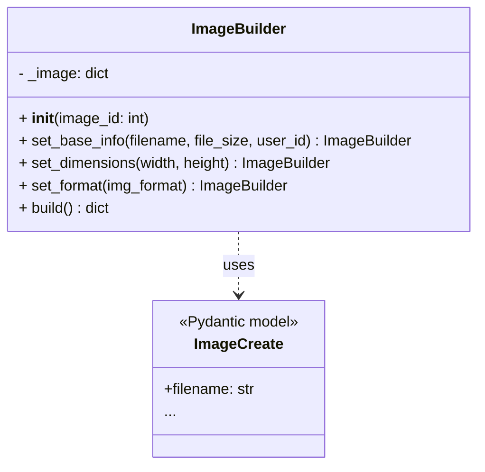

```python
# api.py

class ImageBuilder:
    """
    Строитель для пошагового создания объекта изображения.
    Использует fluent interface для вызова методов цепочкой.
    """
    def __init__(self, image_id: int):
        # Устанавливаем базовые и дефолтные значения
        self._image = {
            "id": image_id,
            "upload_date": datetime.now(),
            "status": ImageStatus.UPLOADED,
            "width": 1920, # Значение по умолчанию
            "height": 1080, # Значение по умолчанию
            "format": "jpg"  # Значение по умолчанию
        }

    def set_base_info(self, filename: str, file_size: int, user_id: int):
        self._image["filename"] = filename
        self._image["file_size"] = file_size
        self._image["user_id"] = user_id
        return self # Возвращаем self для возможности вызова цепочкой

    def set_dimensions(self, width: int, height: int):
        self._image["width"] = width
        self._image["height"] = height
        return self

    def set_format(self, img_format: str):
        self._image["format"] = img_format
        return self

    def build(self) -> dict:
        """Возвращает сконструированный объект изображения."""
        return self._image
```

### Структурные шаблоны

#### Adapter (Адаптер)

Позволяет объектам с несовместимыми интерфейсами работать вместе. "Адаптер" действует как обертка, преобразуя вызовы одного интерфейса в вызовы другого. Это похоже на адаптер для розетки, который позволяет использовать европейскую вилку в американской розетке.

Допустим, мы хотим интегрировать внешнюю систему логирования, которая принимает сообщения в определенном, "чужом" формате (например, XML). Наше приложение привыкло работать с простыми строками. Чтобы не переписывать все вызовы логирования в нашем коде, мы создадим `LoggingAdapter`, который будет принимать нашу простую строку, преобразовывать ее в XML и отправлять во внешнюю систему.

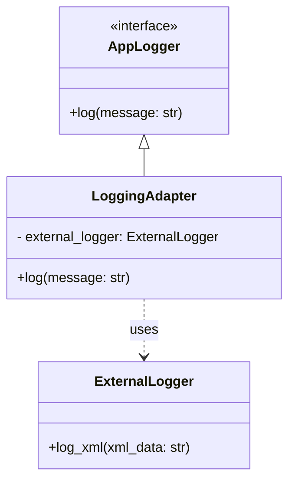

```python
# api.py

class ExternalLogger:
    """
    Имитация внешнего сервиса логирования, который понимает только XML.
    """
    def log_xml(self, xml_data: str):
        # В реальном приложении здесь был бы, например, HTTP-запрос
        print(f"[External Logger] Received XML: {xml_data}")

class LoggingAdapter:
    """
    Адаптер, который преобразует простое сообщение в XML-формат
    и отправляет его во внешний сервис.
    """
    def __init__(self):
        self._external_logger = ExternalLogger()

    def log(self, message: str, severity: str = "INFO"):
        # Преобразование строки в XML
        xml_message = f"<log><severity>{severity}</severity><message>{message}</message></log>"
        self._external_logger.log_xml(xml_message)

# Создаем экземпляр нашего адаптера
app_logger = LoggingAdapter()
```

#### Facade (Фасад)

Предоставляет простой, унифицированный интерфейс для сложной подсистемы. "Фасад" скрывает внутренние сложности и множество взаимодействующих компонентов, предлагая клиенту один удобный метод для выполнения задачи.

Процесс "оценки изображения" (`Assessment`) — сложная операция, включающая несколько шагов:

- Найти изображение в базе данных.
- Найти модель в базе данных.
- Создать саму оценку.
- Создать связанные с ней метрики качества (`QualityMetrics`).

Чтобы не дублировать эту логику в разных частях приложения, мы создаем `AssessmentFacade`. Он предоставляет один метод `create_full_assessment`, который инкапсулирует все эти шаги.

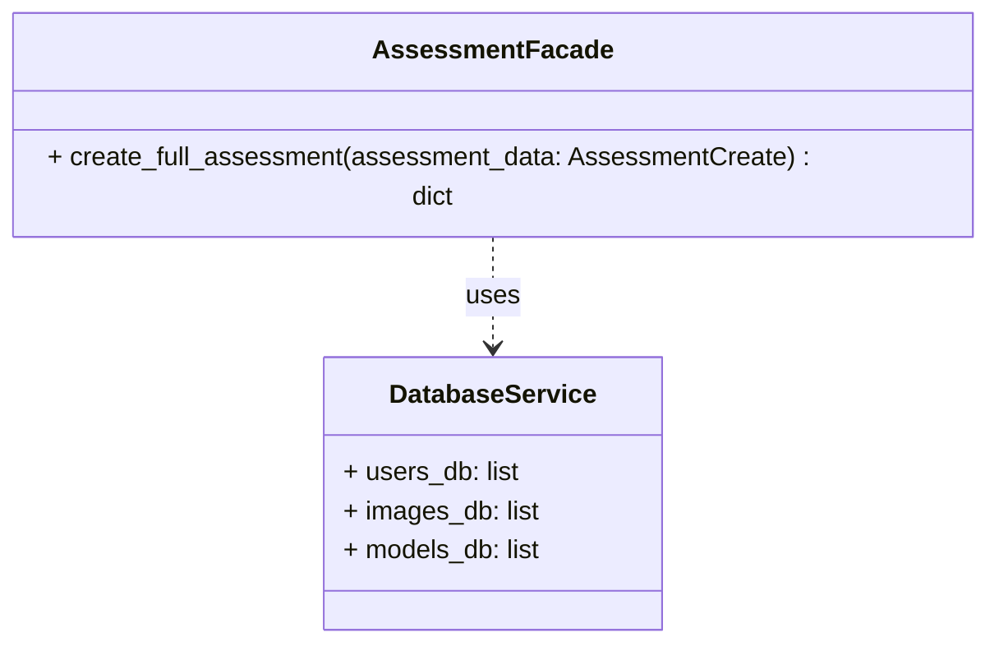

```python
# api.py

class AssessmentFacade:
    """
    Фасад, который упрощает сложный процесс создания оценки,
    скрывая детали взаимодействия с базой данных и связанные сущности.
    """
    def __init__(self, db: DatabaseService):
        self._db = db

    def create_full_assessment(self, assessment_data: AssessmentCreate) -> dict:
        """
        Единый метод, который выполняет всю работу по созданию оценки.
        """
        # 1. Проверяем существование изображения и модели
        if not any(i["id"] == assessment_data.image_id for i in self._db.images_db):
            raise HTTPException(status_code=404, detail="Image not found")
        if not any(m["id"] == assessment_data.model_id for m in self._db.models_db):
            raise HTTPException(status_code=404, detail="Model not found")
        
        # 2. Создаем новую оценку
        new_assessment = {
            "id": len(self._db.assessments_db) + 1,
            **assessment_data.dict(),
            "assessment_date": datetime.now()
        }
        self._db.assessments_db.append(new_assessment)
        
        # 3. Создаем связанные метрики качества
        quality_metrics = {
            "id": len(self._db.quality_metrics_db) + 1,
            "assessment_id": new_assessment["id"],
            "sharpness_score": 0.8,
            "noise_level": 0.1,
            "contrast_ratio": 2.5,
            "blur_detected": False,
            "quality_grade": "good"
        }
        self._db.quality_metrics_db.append(quality_metrics)

        # Логируем через наш адаптер
        app_logger.log(f"Создана новая оценка ID {new_assessment['id']} для изображения ID {new_assessment['image_id']}.")
        
        return new_assessment

# Создаем экземпляр фасада
assessment_facade = AssessmentFacade(db_service)
```

#### Decorator (Декоратор)

Позволяет динамически добавлять новую функциональность объектам, оборачивая их в "декораторы". Это гибкая альтернатива наследованию для расширения функциональности.

FastAPI уже использует этот шаблон повсеместно (@app.get, @app.post). Мы продемонстрируем его, создав собственный декоратор `log_execution_time`, который будет измерять и выводить в лог время выполнения любого эндпоинта, к которому он применен. Это позволяет добавлять функциональность логирования времени, не изменяя код самого эндпоинта.

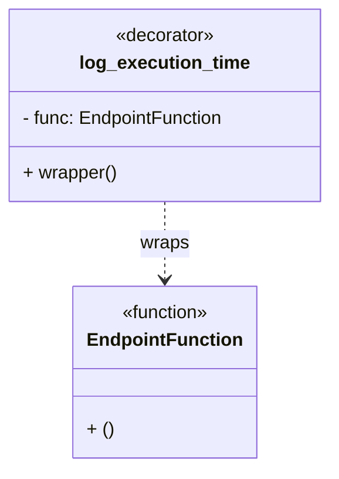

```python
# api.py
import time
from functools import wraps

def log_execution_time(func):
    """
    Декоратор, который логирует время выполнения обернутой функции.
    """
    @wraps(func)
    def wrapper(*args, **kwargs):
        start_time = time.time()
        result = func(*args, **kwargs)
        end_time = time.time()
        execution_time = (end_time - start_time) * 1000  # в миллисекундах
        app_logger.log(f"Функция '{func.__name__}' выполнилась за {execution_time:.2f} мс.")
        return result
    return wrapper

# 16. GET /api/v1/assessments - список оценок
@app.get("/api/v1/assessments", response_model=List[AssessmentResponse])
@log_execution_time  # Применяем наш декоратор!
def get_assessments():
    """Получить список всех оценок GSD"""
    # Имитируем "тяжелую" операцию, чтобы увидеть результат работы декоратора
    time.sleep(0.05) 
    return db_service.assessments_db
```

#### Proxy (Заместитель)

Предоставляет суррогатный объект или "заместителя" для другого объекта, чтобы контролировать доступ к нему. Proxy используется для ленивой инициализации ("ленивца"), контроля доступа, логирования, кеширования и т.д.

Мы создадим `SecureModelProxy`, который будет контролировать доступ к реальным нейросетевым моделям. Proxy будет проверять, имеет ли пользователь право на доступ к модели (например, является ли он администратором). Это позволяет вынести логику проверки прав доступа из основного кода работы с моделями.

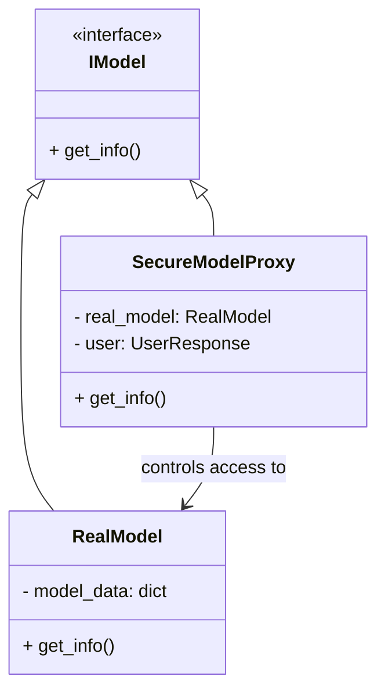

```python
# api.py

class RealModel:
    """Реальный объект модели, который мы хотим защитить."""
    def __init__(self, model_id: int):
        self._model_data = next((m for m in db_service.models_db if m["id"] == model_id), None)
        if self._model_data is None:
            raise HTTPException(status_code=404, detail="Real model not found")
        # Имитация загрузки тяжелого объекта
        print(f"INFO: Загружен реальный объект модели ID {model_id}")

    def get_info(self) -> dict:
        return self._model_data

class SecureModelProxy:
    """
    Заместитель, который контролирует доступ к реальной модели,
    проверяя роль пользователя.
    """
    def __init__(self, model_id: int, user: UserResponse):
        self._model_id = model_id
        self._user = user
        self._real_model: Optional[RealModel] = None

    def _check_access(self) -> bool:
        """Проверяет, имеет ли пользователь право доступа."""
        # Разрешаем доступ только администраторам
        return self._user["role"] == UserRole.ADMIN

    def get_info(self) -> dict:
        """
        Метод, который сначала проверяет доступ, и только потом
        создает реальный объект и возвращает информацию.
        """
        if not self._check_access():
            raise HTTPException(status_code=403, detail="Forbidden: Admin role required")

        # Ленивая инициализация: создаем реальный объект только при необходимости
        if self._real_model is None:
            self._real_model = RealModel(self._model_id)
        
        return self._real_model.get_info()
```

### Поведенческие шаблоны

#### Strategy (Стратегия)

Определяет семейство схожих алгоритмов и помещает каждый из них в собственный класс. Это позволяет заменять алгоритмы "на лету", делая их взаимозаменяемыми. Клиентский код, использующий эти алгоритмы, не зависит от их конкретной реализации.

В нашем API есть разные роли пользователей (user, admin, moderator). Права на удаление могут отличаться в зависимости от роли. Например:

- `user` может удалять только свои собственные изображения.
- `moderator` может удалять любые изображения, но не пользователей.
- `admin` может удалять все что угодно.

Мы создадим иерархию "Стратегий удаления" (`DeletionStrategy`), каждая из которых будет инкапсулировать свою логику проверки прав.

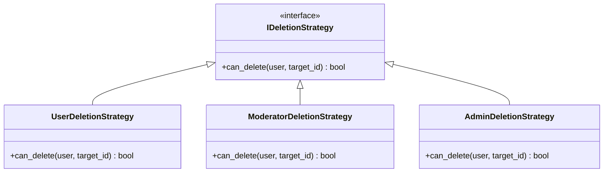

```python
# api.py
from abc import ABC, abstractmethod

class IDeletionStrategy(ABC):
    """Интерфейс для стратегий удаления."""
    @abstractmethod
    def can_delete(self, user: dict, target_owner_id: int) -> bool:
        pass

class UserDeletionStrategy(IDeletionStrategy):
    """Стратегия для обычного пользователя: может удалять только свое."""
    def can_delete(self, user: dict, target_owner_id: int) -> bool:
        return user["id"] == target_owner_id

class ModeratorDeletionStrategy(IDeletionStrategy):
    """Стратегия для модератора: может удалять чужое, но с ограничениями (здесь не реализованы)."""
    def can_delete(self, user: dict, target_owner_id: int) -> bool:
        # Для простоты модератор может удалять все изображения
        return True

class AdminDeletionStrategy(IDeletionStrategy):
    """Стратегия для админа: может удалять все."""
    def can_delete(self, user: dict, target_owner_id: int) -> bool:
        return True

def get_deletion_strategy(user: dict) -> IDeletionStrategy:
    """Фабрика, которая выбирает нужную стратегию в зависимости от роли."""
    role_strategies = {
        UserRole.USER: UserDeletionStrategy(),
        UserRole.MODERATOR: ModeratorDeletionStrategy(),
        UserRole.ADMIN: AdminDeletionStrategy(),
    }
    return role_strategies.get(user["role"], UserDeletionStrategy()) # По умолчанию - самая строгая
```

#### Observer (Наблюдатель)

Создает механизм подписки, позволяющий одним объектам ("наблюдателям") следить за изменениями в другом объекте ("субъекте") и реагировать на них. Когда состояние субъекта меняется, он уведомляет всех своих подписчиков.

Мы хотим создать систему уведомлений. Когда создается новый пользователь (User), мы хотим, чтобы разные части системы могли на это отреагировать. Например, `EmailNotifier` должен отправить приветственное письмо, а AuditLogger — записать событие в лог аудита. Шаблон "Наблюдатель" идеально подходит для этого. `UserManager` будет "субъектом", а `EmailNotifier` и `AuditLogger` — "наблюдателями".

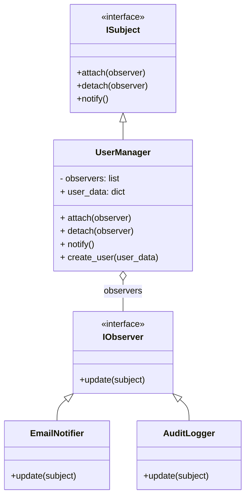

```python
# api.py

class IObserver(ABC):
    """Интерфейс Наблюдателя."""
    @abstractmethod
    def update(self, subject) -> None:
        pass

class EmailNotifier(IObserver):
    """Конкретный наблюдатель, отправляющий email."""
    def update(self, subject) -> None:
        user_email = subject.user_data["email"]
        username = subject.user_data["username"]
        print(f"NOTIFICATION: Отправка приветственного письма на {user_email} для пользователя {username}.")

class AuditLogger(IObserver):
    """Конкретный наблюдатель, логирующий событие аудита."""
    def update(self, subject) -> None:
        username = subject.user_data["username"]
        # Используем наш адаптер из структурных шаблонов
        app_logger.log(f"Создан новый пользователь '{username}'.", severity="AUDIT")

class UserManager:
    """Субъект, который управляет пользователями и уведомляет наблюдателей."""
    _observers: List[IObserver] = []
    user_data: dict = {}

    def attach(self, observer: IObserver) -> None:
        self._observers.append(observer)

    def detach(self, observer: IObserver) -> None:
        self._observers.remove(observer)

    def notify(self) -> None:
        """Уведомить всех наблюдателей."""
        for observer in self._observers:
            observer.update(self)

    def create_user(self, user: UserCreate):
        # ... (логика создания пользователя) ...
        new_user_id = len(db_service.users_db) + 1
        self.user_data = UserFactory.create_user(user, new_user_id)
        db_service.users_db.append(self.user_data)
        
        # После создания - уведомить всех подписчиков
        self.notify()
        return self.user_data
```

#### State (Состояние)

Позволяет объекту изменять свое поведение при изменении его внутреннего состояния. Внешне это выглядит так, как будто объект меняет свой класс.

У нас есть сущность Image со статусами (uploaded, processing, completed, failed). Поведение, доступное для изображения, зависит от его текущего состояния. Например:

- В состоянии uploaded можно запустить обработку (process()).
- В состоянии processing нельзя ничего делать, нужно ждать.
- В состоянии completed можно запросить результат (get_result()).
- В любом состоянии можно отменить (cancel()).

Мы создадим иерархию состояний (`ImageState`), и объект `ImageContext` будет делегировать вызовы текущему объекту-состоянию.

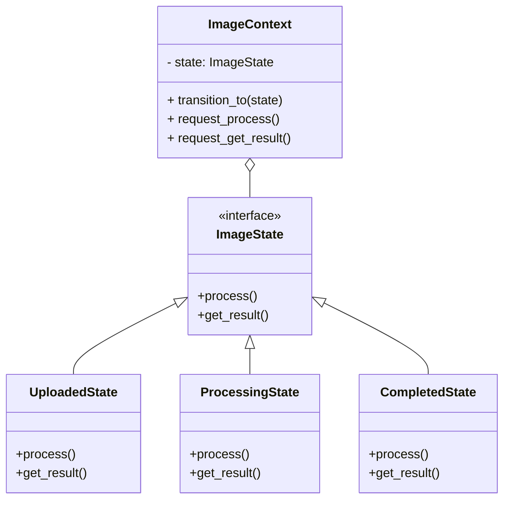

```python
# api.py

class ImageContext:
    """Контекст, который хранит текущее состояние Изображения."""
    _state = None

    def __init__(self, state: 'ImageState', image_id: int):
        self.image_id = image_id
        self.transition_to(state)

    def transition_to(self, state: 'ImageState'):
        """Сменить состояние."""
        print(f"Image {self.image_id}: переход в состояние {type(state).__name__}")
        self._state = state
        self._state.context = self

    def request_process(self):
        self._state.process()

    def request_get_result(self):
        return self._state.get_result()

class ImageState(ABC):
    """Базовый класс Состояния."""
    @property
    def context(self) -> ImageContext:
        return self._context

    @context.setter
    def context(self, context: ImageContext) -> None:
        self._context = context

    @abstractmethod
    def process(self) -> None: pass

    @abstractmethod
    def get_result(self) -> dict: pass


class UploadedState(ImageState):
    """Состояние 'Загружено'."""
    def process(self) -> None:
        print(f"Image {self.context.image_id}: Начинаю обработку...")
        # ... логика обработки ...
        self.context.transition_to(ProcessingState())

    def get_result(self) -> dict:
        raise HTTPException(status_code=400, detail="Image has not been processed yet.")


class ProcessingState(ImageState):
    """Состояние 'В обработке'."""
    def process(self) -> None:
        print(f"Image {self.context.image_id}: Уже в обработке. Пожалуйста, подождите.")
        # Для симуляции завершения
        self.context.transition_to(CompletedState())

    def get_result(self) -> dict:
        raise HTTPException(status_code=400, detail="Image is still being processed.")

class CompletedState(ImageState):
    """Состояние 'Завершено'."""
    def process(self) -> None:
        print(f"Image {self.context.image_id}: Обработка уже завершена.")

    def get_result(self) -> dict:
        print(f"Image {self.context.image_id}: Возвращаю результат.")
        # Имитация результата
        return {"gsd_value": 5.5, "status": "completed"}
```

#### Command (Команда)

Превращает запрос в самостоятельный объект, содержащий всю информацию об этом запросе. Это позволяет параметризовать клиентские объекты независимыми запросами, ставить запросы в очередь, логировать их, а также поддерживать отмену операций.

В нашем API есть множество операций (`create_user`, `update_model` и т.д.). Мы можем обернуть вызов каждой такой операции в объект-команду. Это позволит нам создать "историю команд" (`CommandHistory`), чтобы логировать все действия, или даже реализовать отмену последней операции.

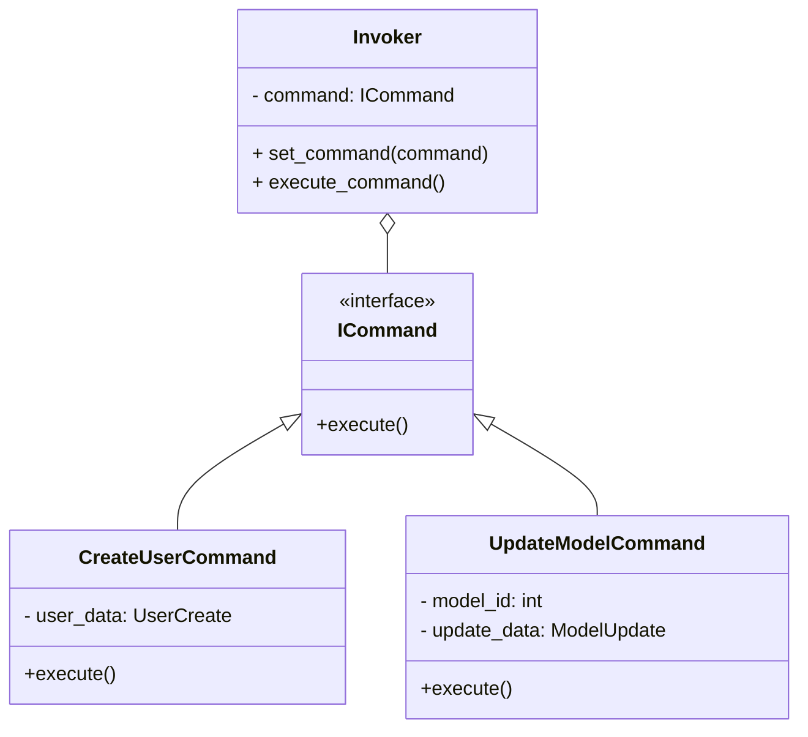

```python
# api.py

class ICommand(ABC):
    """Интерфейс Команды."""
    @abstractmethod
    def execute(self) -> any:
        pass

class CreateUserCommand(ICommand):
    """Команда для создания пользователя."""
    def __init__(self, user_data: UserCreate):
        self._user_data = user_data
    
    def execute(self) -> dict:
        print("Executing CreateUserCommand...")
        # Логика создания пользователя
        # ... (проверки, создание словаря) ...
        new_user = {"id": len(db_service.users_db) + 1, **self._user_data.dict()}
        db_service.users_db.append(new_user)
        return new_user

class CommandHistory:
    """Invoker, который также хранит историю выполненных команд."""
    _history: List[ICommand] = []

    def execute_command(self, command: ICommand) -> any:
        self._history.append(command)
        app_logger.log(f"Команда '{type(command).__name__}' поставлена в очередь.")
        return command.execute()
    
    def get_history(self) -> list:
        return [type(cmd).__name__ for cmd in self._history]
```

#### Template Method (Шаблонный метод)

Определяет "скелет" алгоритма в методе базового класса, но перекладывает реализацию некоторых шагов на подклассы. Это позволяет подклассам переопределять только определенные части алгоритма, не меняя его общую структуру.

Мы создадим абстрактный класс `BaseDeletionProcess` с "шаблонным методом" delete(), который определяет эту структуру. Конкретные классы `UserDeletionProcess` и `ImageDeletionProcess` будут реализовывать только один абстрактный метод `_delete_related_data`().

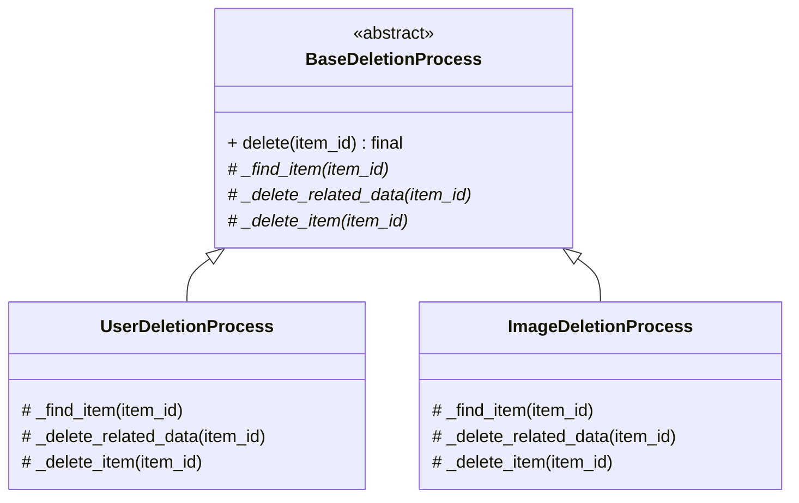

```python
# api.py

class BaseDeletionProcess(ABC):
    """Абстрактный класс, определяющий скелет алгоритма удаления."""

    def delete(self, item_id: int) -> dict:
        """Шаблонный метод. Он final (в Python эмулируется)."""
        item = self._find_item(item_id)
        if not item:
            raise HTTPException(status_code=404, detail=f"{self._item_name} not found")

        self._delete_related_data(item)
        self._delete_item(item_id)

        app_logger.log(f"{self._item_name} с ID {item_id} успешно удален.")
        return {"message": f"{self._item_name} with ID {item_id} deleted successfully"}

    @abstractmethod
    def _find_item(self, item_id: int) -> Optional[dict]: pass

    @abstractmethod
    def _delete_related_data(self, item: dict) -> None: pass
    
    @abstractmethod
    def _delete_item(self, item_id: int) -> None: pass
    
    @property
    @abstractmethod
    def _item_name(self) -> str: pass


class ImageDeletionProcess(BaseDeletionProcess):
    """Конкретная реализация для удаления Изображений."""
    _item_name = "Image"
    
    def _find_item(self, item_id: int) -> Optional[dict]:
        return next((i for i in db_service.images_db if i["id"] == item_id), None)

    def _delete_related_data(self, item: dict) -> None:
        """Уникальный шаг: удаляем связанные оценки."""
        print(f"Deleting related assessments for image {item['id']}")
        db_service.assessments_db = [a for a in db_service.assessments_db if a["image_id"] != item["id"]]

    def _delete_item(self, item_id: int) -> None:
        db_service.images_db = [i for i in db_service.images_db if i["id"] != item_id]
```

## Шаблоны проектирования GRASP

### Роли (обязанности) классов

#### Information Expert (Информационный эксперт)

**Проблема**: Какому классу поручить ту или иную обязанность?

**Решение**: Обязанность следует назначать тому классу, который владеет большей частью информации, необходимой для ее выполнения.

**Пример**: Класс `SecureModelProxy` отвечает за проверку прав доступа к модели (`_check_access`). Он является "Информационным экспертом", так как владеет всей необходимой информацией: ссылкой на пользователя (`_user`) и его ролью.

```python
class SecureModelProxy:
    def __init__(self, model_id: int, user: UserResponse):
        # ...
        self._user = user # Владеет информацией о пользователе

    def _check_access(self) -> bool:
        """Проверяет, имеет ли пользователь право доступа."""
        # Использует свою информацию для выполнения обязанности
        return self._user["role"] == UserRole.ADMIN

```

**Результат**: Улучшается инкапсуляция, код становится более понятным и поддерживаемым, так как классы оперируют данными, которыми они владеют.

**Связь с другими паттернами**: Лежит в основе многих GoF-паттернов, например, Facade (фасад владеет информацией о сложной подсистеме), State (объект-состояние владеет информацией о поведении в этом состоянии).

#### Creator (Создатель)

**Проблема**: Какой класс должен создавать экземпляры другого класса?

**Решение**: Класс A должен создавать экземпляры класса B, если выполняется одно из условий: A агрегирует B, A содержит B, A активно использует B, A имеет данные для инициализации B.

**Пример**: Наш `UserFactory` является "Создателем" для объектов-пользователей. Он получает данные UserCreate (`user_data`) и создает из них новый объект.

```python
class UserFactory:
    @staticmethod
    def create_user(user_data: UserCreate, user_id: int) -> dict:
        """
        "Создатель": имеет все данные (user_data, user_id)
        для конструирования нового пользователя.
        """
        new_user_dict = {
            "id": user_id,
            **user_data.dict(),
            # ...
        }
        return new_user_dict

```

**Результат**: Уменьшается связанность между классами, так как клиент не зависит от конкретного процесса создания объекта.

**Связь с другими паттернами**: Является прямой реализацией GoF-паттернов Factory Method и Builder.

#### Controller (Контроллер)

**Проблема**: Кто должен обрабатывать входящие системные события?

**Решение**: Следует выделить специальный класс-"контроллер", который принимает запрос и координирует его выполнение, делегируя работу другим объектам. Он служит "точкой входа" для запроса.

**Пример**: В нашем FastAPI-приложении эту роль выполняют функции-эндпоинты, декорированные @app.get, @app.post и т.д. Они принимают HTTP-запрос и делегируют работу другим объектам (фасадам, фабрикам, сервисам).

```python
@app.post("/api/v1/assessments", response_model=AssessmentResponse, status_code=201)
def create_assessment(assessment: AssessmentCreate): # Это Контроллер
    """Создать новую оценку GSD"""
    # Делегирует всю работу Фасаду
    new_assessment = assessment_facade.create_full_assessment(assessment)
    return new_assessment

```

**Результат**: Отделяет логику представления (в нашем случае, API-интерфейс) от бизнес-логики.

**Связь с другими паттернами**: Часто использует Facade для делегирования работы. Является основой паттерна MVC (Model-View-Controller).

#### Low Coupling (Слабая связанность)

**Проблема**: Как уменьшить зависимость между классами, чтобы изменения в одном классе как можно меньше влияли на другие?

**Решение**: Распределять обязанности так, чтобы классы как можно меньше знали о внутреннем устройстве друг друга.

**Пример**: Применение шаблона Observer. UserManager ("субъект") ничего не знает о конкретных классах EmailNotifier и AuditLogger ("наблюдателях"). Он знает только об их общем интерфейсе IObserver. Это и есть слабая связанность.

```python
class UserManager:
    _observers: List[IObserver] = [] # Зависит от абстракции, а не от конкретики

    def notify(self) -> None:
        """Уведомить всех наблюдателей."""
        for observer in self._observers:
            observer.update(self) # Вызывает метод из общего интерфейса

```

**Результат**: Повышается переиспользуемость кода, система становится более устойчивой к изменениям.

**Связь с другими паттернами**: Один из ключевых принципов ООП. Шаблоны Observer, Strategy, Command напрямую способствуют его достижению.

#### High Cohesion (Сильная связность)

**Проблема**: Как сделать классы более сфокусированными, понятными и управляемыми?

**Решение**: Обязанности класса должны быть тесно связаны и сфокусированы на одной задаче. Класс не должен делать "все подряд".

**Пример**: Наш AssessmentFacade. Все его методы направлены на одну-единственную цель — управление сложными операциями, связанными с "Оценками". Он не занимается управлением пользователями или моделями.

```python
class AssessmentFacade:
    """
    Пример высокой сплоченности: все методы этого класса
    связаны с одной задачей - управлением "Оценками".
    """
    def __init__(self, db: DatabaseService):
        self._db = db

    def create_full_assessment(self, assessment_data: AssessmentCreate) -> dict:
        # ... логика, связанная только с оценками ...
        pass

```

**Результат**: Упрощается понимание и поддержка кода. Классы с высокой сплоченностью легче переиспользовать.

**Связь с другими паттернами**: Facade и Singleton — хорошие примеры. DatabaseService (Singleton) сфокусирован только на хранении данных.

### Принципы разработки

#### Indirection (Посредник)

**Проблема**: Как избежать прямой связи между двумя элементами, чтобы уменьшить зацепление?

**Решение**: Ввести промежуточный объект-"посредник", который будет обеспечивать их взаимодействие.

**Пример**: Шаблон Adapter является классической реализацией этого принципа. LoggingAdapter выступает посредником между нашим приложением и ExternalLogger. Приложение не знает о существовании ExternalLogger.

```python
class LoggingAdapter: # Это Посредник
    def __init__(self):
        self._external_logger = ExternalLogger()

    def log(self, message: str, severity: str = "INFO"):
        xml_message = f"<log>...</log>"
        # Взаимодействует с внешней системой, скрывая это от клиента
        self._external_logger.log_xml(xml_message)

# Клиентский код:
app_logger.log("Сообщение") # Клиент общается только с посредником

```

**Результат**: Снижается связанность между компонентами.

**Связь с другими паттернами**: Adapter, Proxy, Facade, Observer — все они основаны на этом принципе.

#### Protected Variations (Защита от изменений)

**Проблема**: Как защитить систему от изменений в других системах, от которых она зависит?

**Решение**: Определить "точку нестабильности" (то, что может измениться) и создать вокруг нее стабильный интерфейс, который скроет эту нестабильность.

**Пример**: Шаблон Strategy. Логика проверки прав на удаление — это "нестабильная" часть (она может меняться). Мы создали стабильный интерфейс IDeletionStrategy и спрятали за ним все конкретные реализации (UserDeletionStrategy, AdminDeletionStrategy). Если нам понадобится новая роль, мы просто добавим новую стратегию, не трогая код, который ее использует.

```python
# Стабильный интерфейс
class IDeletionStrategy(ABC):
    @abstractmethod
    def can_delete(self, user: dict, target_owner_id: int) -> bool:
        pass

# Клиентский код зависит только от стабильного интерфейса
strategy: IDeletionStrategy = get_deletion_strategy(deleter_user)
if not strategy.can_delete(...):
    # ...
```

**Результат**: Повышается устойчивость системы к изменениям.

**Связь с другими паттернами**: Strategy, Adapter, Factory Method, Bridge.

#### Polymorphism (Полиморфизм)

**Проблема**: Как обрабатывать объекты разных типов единообразно?

**Решение**: Использовать механизм полиморфизма, при котором разные классы реализуют один и тот же интерфейс, а клиентский код вызывает методы через этот интерфейс, не зная о конкретном типе объекта.

**Пример**: Шаблон Template Method. Наш BaseDeletionProcess определяет общий алгоритм. Конкретные классы ImageDeletionProcess и UserDeletionProcess по-разному реализуют метод _delete_related_data, но для клиента они выглядят одинаково.

```python
# Определяем "скелет" в базовом классе
class BaseDeletionProcess(ABC):
    def delete(self, item_id: int) -> dict:
        # ...
        self._delete_related_data(item) # Полиморфный вызов
        # ...

# Клиентский код:
# process может быть экземпляром ImageDeletionProcess или UserDeletionProcess
process: BaseDeletionProcess = ImageDeletionProcess() 
process.delete(1) # Выглядит одинаково, но поведение разное

```

**Результат**: Устраняются длинные цепочки if-elif-else для проверки типа объекта. Код становится более расширяемым.

**Связь с другими паттернами**: Strategy, State, Template Method, Observer.

### Свойство программы (цель)

#### Pure Fabrication (Чистая выдумка)

**Проблема**: Иногда ни один из существующих "реальных" классов не подходит на роль "информационного эксперта". Назначение ему новой обязанности нарушит принцип высокой сплоченности.

**Решение**: Создать искусственный, "выдуманный" класс (который не представляет сущность из предметной области), чтобы поручить ему эту обязанность.

**Пример**: Наш DatabaseService (Singleton) является "чистой выдумкой". В предметной области "оценки изображений" нет сущности "сервис базы данных". Мы "выдумали" его, чтобы решить проблему хранения данных в памяти и централизации доступа к ним, не "загрязняя" другие классы этой обязанностью.

```python
class DatabaseService: # Это "Чистая выдумка"
    _instance = None

    @staticmethod
    def get_instance():
        # ...

    def __init__(self):
        self.users_db = []
        self.images_db = []
        # ...

```

**Результат**: Сохраняется высокая сплоченность и слабая связанность существующих классов.

**Связь с другими паттернами**: Многие сервисные классы, фабрики, фасады являются "чистыми выдумками".
